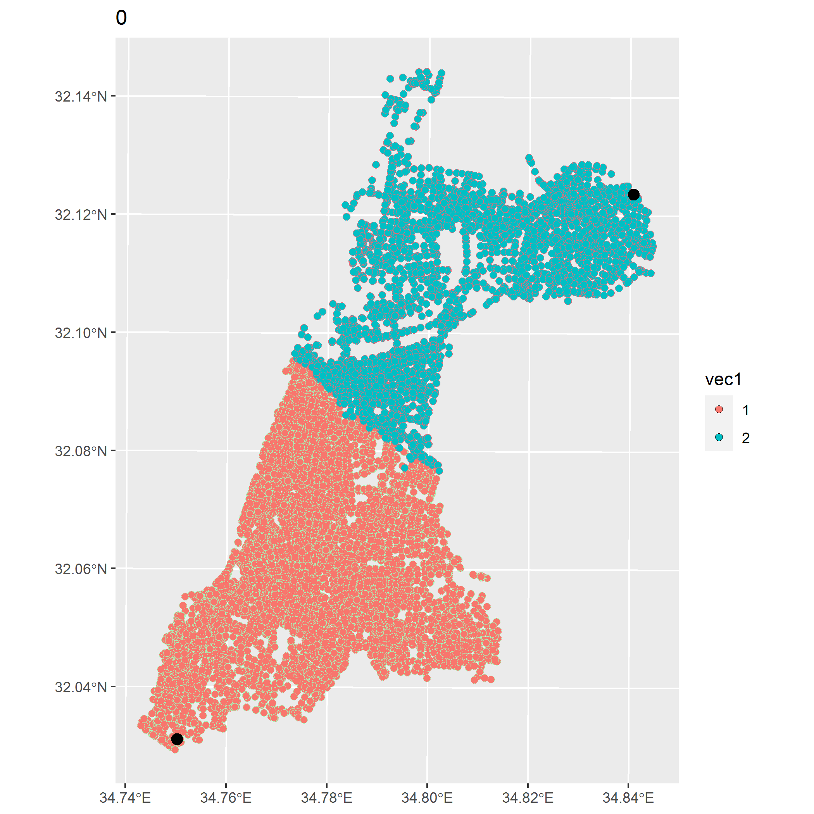

```{css echo = FALSE}
p,h1,h2,h3,h4,h5{text-align:right;dir:rtl};
code{text-align:left;dir:ltr};
```


```{r setup, include=FALSE}
knitr::opts_chunk$set(echo = TRUE)
```


```{r libraries, echo=TRUE, message=FALSE, warning=FALSE,results = FALSE}
library(tidyverse)
library(sf)
library(sfnetworks)
library(tidygraph)
library(igraph)
library(lwgeom)
library(nngeo)
library(mapview)
library(osmdata)
library(randomcoloR)
library(viridis)
library(gifski)
library(fs)
Sys.setlocale(locale = "hebrew")
```

```{r load data, message=FALSE, warning=FALSE,results = FALSE}
gush_dan <- st_read("D:/Downloads/israel-ISR_gpkg/tel_aviv-4309.gpkg",layer = "edges")
dat1 <- opq_osm_id (type = "relation", id = "1382494") %>%
    opq_string () %>%
    osmdata_sf ()
tlv <- dat1$osm_multipolygons 
```

```{r start manipulating, message=FALSE, warning=FALSE,results = FALSE}
step1 <- st_intersection(gush_dan,tlv)
step2 <- step1 %>% st_transform(2039)
step3 <- step2 %>% select()
step4 <- step3 %>% st_cast("LINESTRING")
pts <- step4 %>% 
  st_line_sample(density = 1/300) %>% 
  st_cast("POINT") %>% 
  st_sf()  %>% 
  filter(!st_is_empty(geometry)) %>% 
  `$`(geometry)
step5 <- step4 %>% 
  as_sfnetwork() %>% 
  st_network_blend(pts,0.1) %>% 
  activate(edges) %>% 
  st_as_sf()
```

```{r network and distance matrix, message=FALSE, warning=FALSE,results = FALSE}
net <- as_sfnetwork(step5)
in_giant <- net %>% components() %>% `$`(membership) %>% `==`(1)
net1 <- net %>% 
  filter(in_giant) %>% 
  activate(edges) %>% 
  filter(!edge_is_multiple()) %>% 
  filter(!edge_is_loop()) %>% 
  activate(nodes)
  
mat <- net1 %>% 
  st_network_cost()
```

```{r walkshed optimization, message=FALSE, warning=FALSE, results = FALSE}
K <- 20
cols <- randomColor(K)
colnames(mat) <- rownames(mat) <- as.numeric(1:nrow(mat))
vec <- mat[,1:K] %>% apply(1,which.min)
new_centers <- map_dbl(1:K,function(x){
  if(length(mat[vec == x,vec == x]) == 1){
    x
  }else{
    mat[vec == x,vec == x] %>% 
      apply(1,max) %>%
      which.min() %>% 
      names() %>% 
      as.numeric()   
  }
})
old_centers <- vec
p <- ggplot() +
  geom_sf(data = net1 %>% st_as_sf() %>% mutate(vec = factor(vec)),mapping = aes(color = vec,fill = vec),stroke = 0.3,size = 2,shape = 21) +
  geom_sf(data = net1 %>% st_as_sf() %>% slice( new_centers),color = "black",size =3) +
  ggtitle("1") +
  scale_color_manual(values = cols,guide = "none")
ggsave("01.png")
Z <- 100
lst <- list(Z)
i = 2
for(x1 in 1:Z){
  print(x1)
  lst[[x1]] <- net1 %>%
    activate(nodes) %>%
    st_as_sf() %>%
    mutate(vec = vec, z=x1)
  # reassign to clusters
  vec <- mat[,new_centers] %>% apply(1,which.min)
  mins <- mat[,new_centers] %>% apply(1,min)
  print(max(mins))
  # refind new centers
  new_centers <- map_dbl(1:K,function(x){
    if(length(mat[vec == x,vec == x]) == 1){
      new_centers[x]
    }else{
      mat[vec == x,vec == x] %>% 
        apply(1,max) %>%
      
        which.min() %>% 
        names() %>% 
        as.numeric()   
    }
  })  
  if(identical(old_centers,vec)){
    break
  }
  old_centers <- vec
  
  p <- ggplot() +
    geom_sf(data = net1 %>% st_as_sf() %>% mutate(vec = factor(vec)),mapping = aes(color = vec,fill = mins),stroke = 0.3,size = 2,shape = 21) +
    geom_sf(data = net1 %>% st_as_sf() %>% slice( new_centers),color = "black",size =3) +
    ggtitle(i)+
    scale_color_manual(values = cols,guide = "none")+
    scale_fill_viridis(option = "magma",limits = c(0,5000))
  ggsave(paste0(ifelse(i<10,paste0("0",i),i),".png"))
  i <- i + 1
}
paths <- dir_info() %>% 
  filter(str_detect(path,"png")) %>% 
  pull(path)
gif_file <- file.path("result.gif")
gifski(paths[-1], gif_file,width = 2100,height = 2100,delay = 0.2)
unlink(paths)
```

